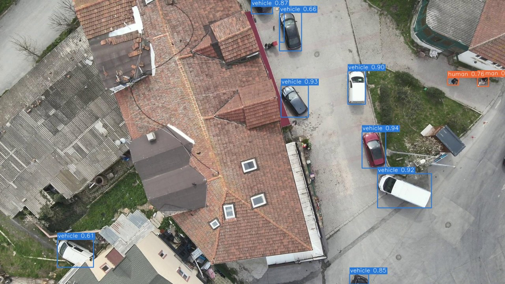
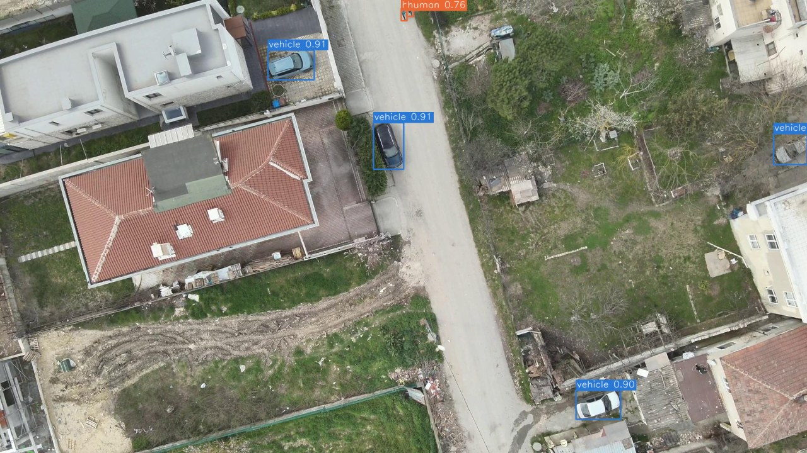
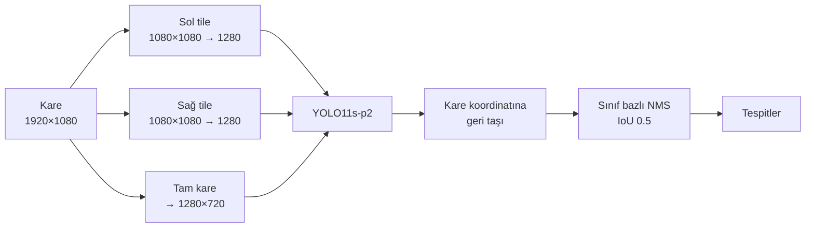
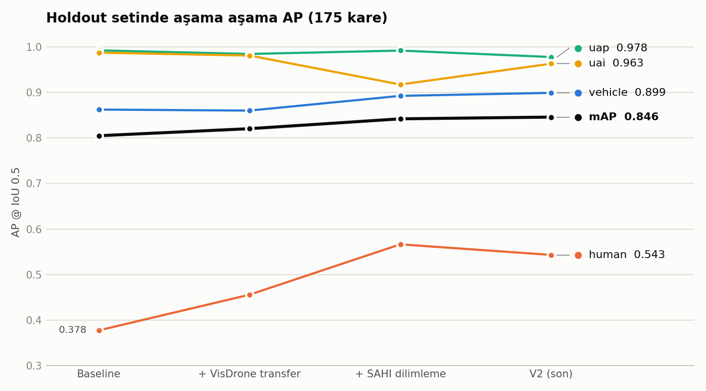

# UAV Object Detection

İHA alt-görüş (yukarıdan bakan) kamera karelerinde **küçük nesne tespiti**: taşıt, insan
ve iki tür iniş alanı işareti. YOLO11s + P2 başlığı, iki aşamalı transfer öğrenme ve
maliyeti ölçülerek seçilmiş bir dilimleme (tiling) düzeni.

- **Girdi:** 1920×1080 alt-görüş drone karesi
- **Çıktı:** kutu (x1, y1, x2, y2) + sınıf + güven skoru
- **Sınıflar:** `vehicle` (tüm taşıtlar) · `human` · `uap` (uçan araba park alanı) · `uai` (uçan ambulans iniş alanı)
- **Metrik:** mAP @ IoU 0.5

| Holdout mAP@0.5 | human AP | Çıkarım | Maliyet |
|---|---|---|---|
| **0.846** (baseline 0.805) | **0.543** (baseline 0.378) | 154 ms/kare, RTX 4060 Laptop | 3 forward, ~298 GFLOPs |

<p>
  
  
</p>

<sub>Holdout setinden (eğitimde hiç görülmemiş) iki kare, V2 çıktısı; güven ≥ 0.35 olan kutular çizili.</sub>

## Nasıl çalışıyor

Eğitim verisinde insan kutusunun medyan kenarı ~53 piksel, en küçük %5'i 17 pikselin altında;
holdout karelerinde insanlar daha da küçük. Tam kareyi modele tek seferde vermek bu nesneleri
küçültüyor. Kare ikiye bölünüp büyütülerek ayrıca işleniyor; büyük
nesneler için tam kare geçişi korunuyor.



- **Tile'lar:** x ∈ {0, 840}, yatayda ~%22 örtüşme. 1.19× büyütme küçük insanlar için şart:
  büyütme kaldırılınca human AP belirgin düşüyor.
- **Birleştirme:** sınıf bazlı NMS. GREEDYNMM ve NMM her varyantta daha kötü sonuç verdi.
- Ayrıntılar: [docs/mimari.md](docs/mimari.md)

## Model ve eğitim

**Model:** YOLO11s + **P2 başlığı** (stride-4). Tespit 4 seviyede yapılıyor (P2/P3/P4/P5);
ek yüksek çözünürlüklü seviye küçük nesneler için. Mimari: [configs/yolo11-p2.yaml](configs/yolo11-p2.yaml).
Omurga COCO ağırlığıyla başlıyor, yeni head katmanları sıfırdan öğreniyor.

**İki aşamalı transfer:**

| Aşama | Başlangıç | Veri | Epoch | Ayarlar |
|---|---|---|---|---|
| 1. Ara-domain | COCO | VisDrone-DET | 60 | imgsz 1280, batch 32, patience 20, son 10 epoch mozaik kapalı |
| 2. Son fine-tune | Aşama 1 | kendi veri seti (4 sınıf) | 150 | imgsz 1280, batch 32, patience 40, son 15 epoch mozaik kapalı |

VisDrone aşaması omurgayı drone bakış açısına ve küçük nesneye alıştırıyor. Baseline aynı
ayarlarla yalnız COCO'dan başlatıldı; böylece transferin katkısı adil ölçülüyor. Seed 42,
eğitim bulut GPU'sunda.

## Deney geçmişi

Tüm skorlar **holdout** setinde: eğitimde hiç görülmeyen ayrı bir kaynaktan, elle
etiketlenmiş 175 kare (1920×1080).

| Aşama | mAP@0.5 | vehicle | human | uap | uai | ms/kare |
|---|---|---|---|---|---|---|
| Baseline (COCO → veri seti) | 0.8048 | 0.8622 | 0.3776 | 0.9922 | 0.9872 | – |
| + VisDrone ara-domain transfer | 0.8203 | 0.8600 | 0.4559 | 0.9843 | 0.9808 | – |
| + SAHI dilimleme (6×1024, %30) | 0.8419 | 0.8923 | 0.5664 | 0.9917 | 0.9172 | 303 |
| **V2: 2×1080 tile + tam kare** | **0.8457** | **0.8989** | **0.5432** | **0.9776** | **0.9629** | **154** |

<picture>
  <source media="(prefers-color-scheme: dark)" srcset="docs/assets/ap_history_dark.png">
  
</picture>

- **En büyük kazanç `human`'da:** 0.378 → 0.543 (+0.17). Darboğaz bu sınıf; TIDE analizine
  göre kaybın ana kaynağı arka planın insan sanılması ([results/tide_v2](results/tide_v2/README.md)).
- **V2, SAHI düzenine göre maliyeti %61 düşürüp mAP'yi koruyor.** 6 tile yerine 2 tile:
  asıl israf tekrarlanan tile'lardaydı ([results/cikarim_maliyet_ablasyonu](results/cikarim_maliyet_ablasyonu/README.md)).
- **Satırlar her sınıfta artmıyor.** SAHI aşamasında uai 0.98 → 0.92 düşüyor, V2'de human
  0.566 → 0.543 geriliyor. Holdout'ta kutu sayıları küçük (vehicle 306, human 57, uap 15,
  uai 12), bu yüzden bu farklar anlamlı değil. Eşli bootstrap (200 tekrar, %95 GA):
  V2 − SAHI için Δ mAP +0.003 [−0.020, +0.025], Δ human −0.023 [−0.071, +0.028].
- İlk iki aşamada süre ölçülmedi.

### Denenip elenenler

| Deneme | Sonuç |
|---|---|
| Dilimlenmiş veriyle yeniden fine-tune | holdout mAP 0.742'ye geriledi (olası neden: aynı veriyle ikinci fine-tune aşırı uyum) |
| Küçük tile (512, 640) | daha kötü: aşırı parçalanma yanlış pozitifi patlatıyor (512'de ~38K kutu, 1024'te ~6.9K) |
| Tile büyütmesini kaldırmak (@1024/@1088) | human AP belirgin düşüyor |
| FP16 | yalnız ~%7 hızlanma, human AP −0.023 |
| GREEDYNMM / NMM birleştirme | her varyantta NMS'ten kötü |

## Kurulum

```powershell
python -m venv .venv
.\.venv\Scripts\Activate.ps1
pip install -r requirements-train.txt   # çıkarım + eğitim (torch, ultralytics, sahi)
pip install -e .
```

Yalnız değerlendirme/analiz araçları için hafif kurulum: `pip install -r requirements.txt`
(torch yok). Geliştirme araçları: `pip install -r requirements-dev.txt` + `pre-commit install`.

**Ağırlık:** eğitilmiş model depoya dahil değil; `weights/best.pt` yoluna koyun.

## Kullanım

```powershell
# Tespit (V2 düzeni)
python main.py --source kare.jpg
python main.py --source data/holdout/images --coco-gt data/coco/instances_holdout.json --out preds.json

# Değerlendirme
python scripts/eval/evaluate.py preds.json data/coco/instances_holdout.json --cross-check
python scripts/eval/tide_analysis.py preds.json data/coco/instances_holdout.json

# Eğitim
python scripts/train/train.py --config configs/visdrone-pretrain.yaml
python scripts/train/train.py --config configs/baseline-visdrone.yaml

# Görseller
python scripts/analysis/plot_ap_history.py
python scripts/analysis/render_examples.py kare.jpg --out docs/assets
```

Değerlendirme kendi evaluator'ümüzle yapılıyor (VOC tüm-nokta ve COCO 101-nokta AP) ve
faster-coco-eval ile çapraz kontrol ediliyor; iki sonuç birebir örtüşüyor.

## Yapı

```
main.py                 ana tespit girişi (seçilmiş sürüm: V2)
src/uav_vision/
  classes.py            sınıf tanımları
  detector/             dilimlemeli çıkarım: tile + tam kare + NMS
  eval/                 mAP@0.5: eşleştirme, AP (VOC / COCO-101), faster-coco-eval
configs/                model mimarisi ve eğitim konfigleri
scripts/
  train/                eğitim girişi
  eval/                 tahmin üretimi, değerlendirme, TIDE hata analizi
  analysis/             tile ablasyonu, yanlış pozitif inceleme, görseller
results/                ablasyon sonuçları (her klasörde README + özet JSON)
docs/                   mimari ve görseller
```

## Yol haritası

- Daha büyük bir değerlendirme seti (holdout'taki 57 insan kutusu kararları gürültülü bırakıyor)
- `human` için arka plan yanlış pozitiflerini azaltma (hard negative'ler, veri çeşitlendirme)
- İniş alanı uygunluğu ve nesne hareket durumu (ego-motion + takip)

## Lisans

[AGPL-3.0-or-later](LICENSE). Eğitim ve çıkarım Ultralytics YOLO'ya (AGPL-3.0) dayandığı
için proje de aynı lisansla yayınlanır.

- Eğitim verisi (Roboflow export, CC BY 4.0) bu depoya dahil değildir.
- VisDrone-DET akademik / ticari olmayan kullanım içindir; ondan türeyen ağırlıklar da aynı
  kısıta tabidir.
